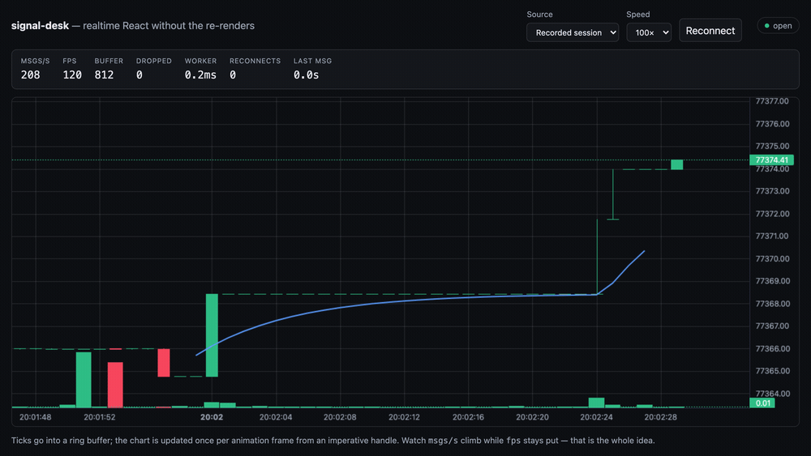

# signal-desk

A high-frequency realtime React UI that **does not turn every incoming event
into a render**.

[](https://github.com/mykolapodpriatov/signal-desk/actions/workflows/ci.yml)
[](https://mykolapodpriatov.github.io/signal-desk/)
[](LICENSE)

**[Live demo →](https://mykolapodpriatov.github.io/signal-desk/)** — set Speed to
100× and watch `msgs/s` climb into the hundreds while `fps` stays where it is
and `dropped` stays at zero. That is the whole argument.



## Why this project exists

The way every tutorial shows a live feed is this:

```tsx
socket.onmessage = (event) => {
  setTicks((current) => [...current, parse(event.data)]);
};
```

It is correct, and it makes the **render rate equal to the event rate** — a
number owned by the exchange, not by your application. A quiet market renders
ten times a second. A volatile one renders three hundred times a second, on the
same laptop, at the exact moment the user needs the screen to respond.

The failure is also hard to attribute. Nothing throws. The chart just gets
sticky when the market gets interesting, which is the worst possible time and
the hardest thing to reproduce afterwards.

## Architecture

```
  WebSocket / replay
          │  a tick is 3 assignments into a Float64Array — no setState,
          │  no allocation, nothing scheduled
          ▼
     ring buffer  (fixed capacity, overwrites oldest, counts what it dropped)
          │
          │  drained once per frame, by cursor
          ▼
  requestAnimationFrame ──▶ candle aggregation ──▶ chart (imperative handle)
          │
          └──▶ Web Worker ──▶ EMA / RSI / ATR   (transferable buffers)
```

| Layer                         | Knows about                             | Must not know about       |
| ----------------------------- | --------------------------------------- | ------------------------- |
| `src/core`                    | ring buffer, candles, indicators, stats | React, sockets, providers |
| `src/stream`                  | one feed's wire format                  | React, the renderer       |
| `src/worker`                  | indicator computation                   | React, the DOM            |
| `src/components`, `src/hooks` | the core and the stream interface       | which feed is behind it   |

ESLint enforces the React-free layers. A ring buffer that needs a component to
exist is one nobody can test at a million ticks.

## Key engineering decisions

### Why WebSocket events don't update React state directly

A tick handler writes three numbers into typed arrays and returns. Once per
animation frame the renderer drains everything that arrived and updates the
chart through an imperative handle. **The work per second is bounded by the
display's refresh rate, not by the exchange's volume** — a feed that triples in
rate does not triple the cost, it makes each frame's batch bigger, which is
nearly free.

[ADR 001](docs/decisions/001-events-do-not-update-react-state.md) also covers
the alternative that is _not_ obviously wrong — throttling `setState` to 16 ms —
and why the frame boundary is the better batching point.

### A dropped tick is counted, not swallowed

The buffer has a fixed capacity and overwrites the oldest tick when full,
because in a live feed the newest data is the data anyone cares about. What it
overwrote before the renderer read it is **counted and shown**. Silent data loss
in a trading UI is worse than visible data loss: a chart missing ticks looks
exactly like a chart with nothing to show.
[ADR 002](docs/decisions/002-ring-buffer-and-backpressure.md).

### Indicators run in a worker for contention, not for speed

EMA over a few hundred bars takes microseconds. The reason it is off the main
thread is that during a burst the main thread has one job — paint — and a
millisecond of maths in the same frame as a sixty-tick batch is the difference
between 60fps and a stutter. The worker imports the _same functions_ the unit
tests exercise, so it cannot quietly disagree with them, and stale responses are
discarded because ticks arrive faster than a round trip.
[ADR 003](docs/decisions/003-indicators-in-a-worker.md).

## Performance

Measured with ticks delivered one flush at a time — the way a socket delivers
them. Batching them in a single `act()` lets React coalesce them into one
render, which reports a fraction of the real cost and flatters the naive version
most, since batching is precisely what hides its problem.

| Ticks | React renders (naive) | React renders (this) | Naive | This |
| ----: | --------------------: | -------------------: | ----: | ---: |
|   100 |                   100 |                **0** | 17 ms | 2 ms |
|   500 |                   500 |                **0** | 51 ms | 1 ms |
| 2,000 |                 2,000 |                **0** | 73 ms | 3 ms |

Not _fewer_ renders. **Zero**, after mount, however many ticks arrive.

Reproduce with `pnpm bench`. The render counts are asserted in CI, so a
regression that reintroduces `setState`-per-tick fails the build; the
milliseconds are from one machine and are indicative only.

In the browser, replaying at 100×: **~200 msgs/s at ~120 fps with 0 dropped
ticks.**

## The data is real

`public/sessions/btcusdt.json` is **5,095 ticks recorded from the live Binance
stream** — 28 per second on average, but bursty: median inter-tick gap `0 ms`,
p95 `227 ms`, max `1.9 s`. That burstiness is the thing that makes realtime
rendering hard, and an evenly-spaced synthetic fixture would have hidden it.

Re-record with `node scripts/record-session.mjs btcusdt 180`.

The demo defaults to the recording rather than the live feed, on purpose: a demo
whose content depends on somebody else's uptime — and on whether the market
happens to be moving when a visitor opens the link — will eventually show an
empty screen. **Live Binance** is one dropdown away, needs no API key, and the
UI says which one you are looking at.

## Testing

98 unit and component tests, 9 Playwright specs, and the benchmark.
`pnpm test` · `pnpm e2e` · `pnpm bench`.

Three things the tests exist to catch, because each is invisible until it is
expensive:

- **A tick exactly on a candle boundary.** It opens the new candle rather than
  closing the old one; getting it wrong by a millisecond shifts every candle.
- **A tick arriving after its candle closed** — clock skew, reconnects. It is
  counted and ignored rather than silently rewriting history the user has seen.
- **Whole-list rendering creeping back.** The benchmark asserts the render
  count, so it fails CI rather than reaching a user whose laptop fan starts up.

Every indicator value is checked against a number computed by hand in a comment.
Checking an indicator against another implementation of the same formula proves
only that two things agree, including when both are wrong.

The E2E suite asserts on the accessible summary and the overlay rather than
pixels — a canvas has nothing to assert against, and a screenshot comparison
would be a rendering test rather than a behaviour test.

## Accessibility

A realtime canvas is a hard case, and the architecture made it harder before it
made it better.

- **The chart has a text alternative** in a live region: latest candle OHLC plus
  the EMA, in words. For a screen-reader user that _is_ the chart.
- **It is updated imperatively and throttled to two seconds.** Because the chart
  component never re-renders, the region would otherwise have announced the
  first candle forever — a defect the architecture caused, found by reading the
  output rather than by a test. A live region changing sixty times a second is
  not an accessible chart either; it is a denial of service on a screen reader.
- **`polite`, never `assertive`.** Assertive would interrupt the reader
  mid-sentence, every two seconds, permanently.
- Connection state is a word, not only a coloured dot. Overlay warnings are a
  colour _and_ a value that changed.
- Every control has an explicit `htmlFor`/`id` label, so a select's accessible
  name is its label rather than its own current value.
- `axe-core` runs over the components in the test suite and fails CI on serious
  or critical violations.

## Running locally

```bash
pnpm install
pnpm dev      # http://localhost:5173, replaying the recorded session
pnpm test     # 98 unit + component tests
pnpm bench    # the render-count comparison
pnpm e2e      # 9 Playwright specs against a production build
pnpm build
```

## Architecture decisions

- [ADR 001 — WebSocket events do not update React state](docs/decisions/001-events-do-not-update-react-state.md)
- [ADR 002 — A fixed ring buffer, and what happens when the consumer falls behind](docs/decisions/002-ring-buffer-and-backpressure.md)
- [ADR 003 — Indicators run in a Web Worker](docs/decisions/003-indicators-in-a-worker.md)

## Roadmap

Tracked as [open issues](https://github.com/mykolapodpriatov/signal-desk/issues).

**Deliberately out of scope**, and staying that way: orders, portfolio,
authentication, alerts, strategies, backtesting. Each would be a plausible next
feature and each would bury the one engineering story this repository is here to
tell.

## License

MIT — see [LICENSE](LICENSE).
